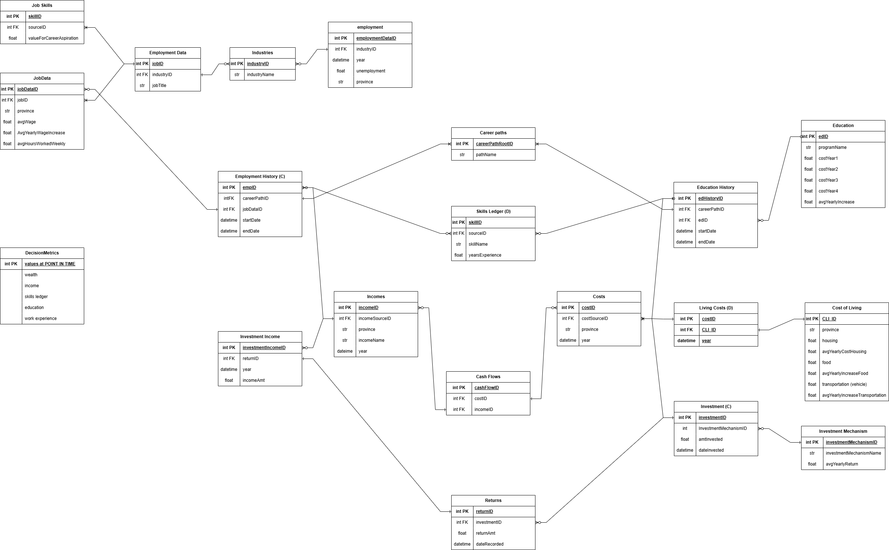

# Data Readme

We require data mainly for economic analysis. We've sourced our data primarly from stats can. 

The career_trajectory_data.xlsx will hold the remaining data, defined in the graphic below. This data will be generated through the use of NotebookLM. 

In the generation of this data, we require the maintenance of referential integrity. I will validate this through the generation process. 

## 1. Job vacancies and average offered hourly wage by occupation (unit group), quarterly, unadjusted for seasonality
Accessed 2/24/2026

This dataset includes employment data, segmented by province and occupation. We are using this dataset to model wages for different jobs (focused within our target sectors) over time. 

## 2. Labour force characteristics by industry, annual 
Accessed 2/24/2026

We're using this dataset to model unemployment by industry. 

## 3. Consumer Price Index by product group, monthly, percentage change, not seasonally adjusted
Accessed 2/24/2026

We're using this dataset to model CPI for core living costs. And using those projections to estimate future costs.  

## 4. tax_brackets_by_province_transposed.csv
Created 2/26/2026

We generated this dataset to model tax expense based on earned income by province (2026 rates).

* Note: Dataset 1,2, and 3 were not committed to the github repo due to size. 

## Data requirements

