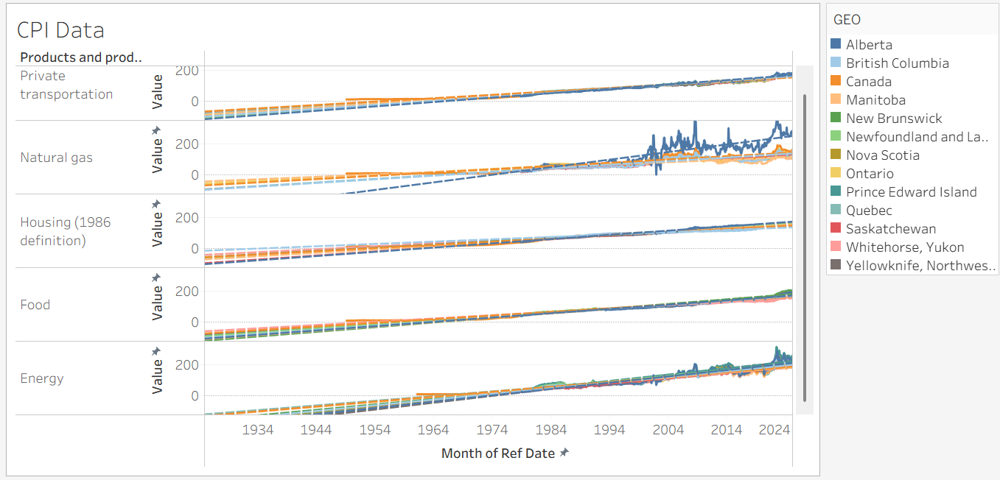
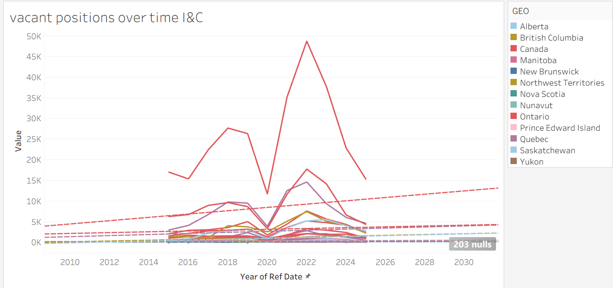
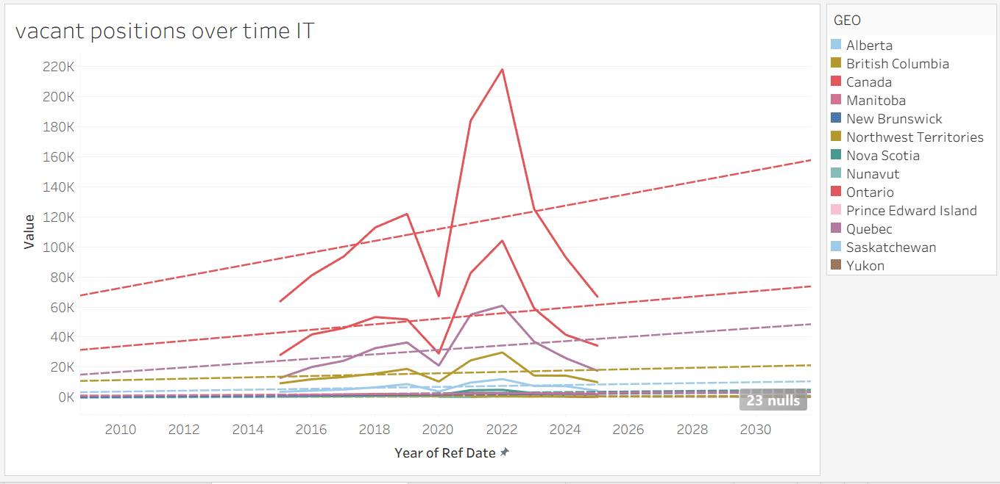

# Career Trajectory NPV Calculator

## Decision Statment
“Should a BIS undergraduate in NS pursue a job related to their degree, or a Instrumentation & Control Technician red seal upon graduation within Canada; given target career trajectory and financial metrics?”

## Executive Summary
This decision pertains to the professional development of this young person; what route they’re going to take into their career. Tradeoffs include income & long term financial position, education, skills developed & experience gained. 

A red seal would provide increased long term job security, and a set of specialized skills and experience, but postpone full time entry to the workforce due to education *requirements.

## Causal Loop Diagram

feedback loop 1: profit -> investment -> returns -> income -> profit
--> Reinforcing returns on capital (compounding)

feedback loop 2: Experience -> Skills -> Experience
--> Reinforcing competence development. Higher skills gain you access to more difficult problems, and the opportunity to work alongside more competent people. Those, in turn, tend to benefit skill development. 

# 2nd Deliverable Additions

## Causal Loop Justification

* The 1st feedback loop requires capital to start. Further, compounding works in both directions. Thus, cost & debt managment is important. Revenue generation is also important. Revenue comes from cabapbilities; skills and experience.  

* The 2nd feedback loop requires we have suffecient of either to get a job in the field of interest, else we lose out of developing both to work an unrelated job. Education is an attempt to kickstart the 2nd loop. 

Figure 5 depicts the relationship between earnings and taxes. Taxes, as a cost, increase variably based income (tax brackets).

Figure 1 depicts the CPI. The CPI is a direct representation of how various cost groups inflate over time. As CPI cost categories increase, so do total costs. 

Figure 4 dipicts how province of residency impacts earned income for different target jobs. We didn't assign -/+ directionality for provincial relationships, as this is a categorical variable. 

## Exploritory Data Analysis (EDA)

Figure 1. Unemployment rate by province

The above visualization depicts the CPI growth of common expenses for individuals. All of these costs are increasing, with provincial hubs experiencing different pressures. 

Contemporarily, Alberta has been facing disproportionate variability (and increases) in natural gas prices. 

Note: This is CPI data, not raw values. This data will be useful for modelling future cost trends using regression as 'm'. We will need to find an alternative data source for 'b'. 

Figure 2. Vacancies for I&C and adjacent jobs

The above visualization depicts job listings for I&C or adjacent positions accross Canada, distinguished by province. There is a positive trend, implying increasing quantities of vacant positions advertised. 

Figure 3. Vacancies for IT and adjacent jobs

This visualization is an imatation of the previous; but filtered based on typical IT jobs - data science, cybersecurity analyst, Networking engineer, and adjacent positions. There is a positive trend, implying increasing quantities of vacant positions advertised.

Figure 4. Wages by province and job

This is all wages advertised in job vacancies in 2025, sorted by province and job category. I've highlighted the I&C trade jobs with red arrows on the left, to distinguish them from the tech jobs. Both IT & I&C routes have $40-50/hr potential for standard roles. Specializations can earn premiums. Management roles have higher potential pay, but content of work shifts from 'engineering' (vertical skill development) to 'managment' (horizontle skill development). 

Figure 5. Tax rate vs. tax bracket by province. 

This visualization depicts tax rates vs. tax brackets by province. The federal tax is larger than provincial taxes. Provincial differences are significant. Nunavut would appear to have the least provincial taxes, while Newfoundland would appear to have the most. 

# Data Statment

Datasets used in this analysis come are sources from below.

APA --> Datasets
Government of Canada, S. C. (2007, June 19). Consumer Price Index by product group, monthly, percentage change, not seasonally adjusted, Canada, provinces, Whitehorse, Yellowknife and Iqaluit. https://www150.statcan.gc.ca/t1/tbl1/en/tv.action?pid=1810000413

Government of Canada, S. C. (2018, June 27). Labour force characteristics by industry, annual. https://www150.statcan.gc.ca/t1/tbl1/en/tv.action?pid=1410002301

Government of Canada, S. C. (2024, March 19). Job vacancies and average offered hourly wage by occupation (unit group), quarterly, unadjusted for seasonality. https://www150.statcan.gc.ca/t1/tbl1/en/tv.action?pid=1410044401
