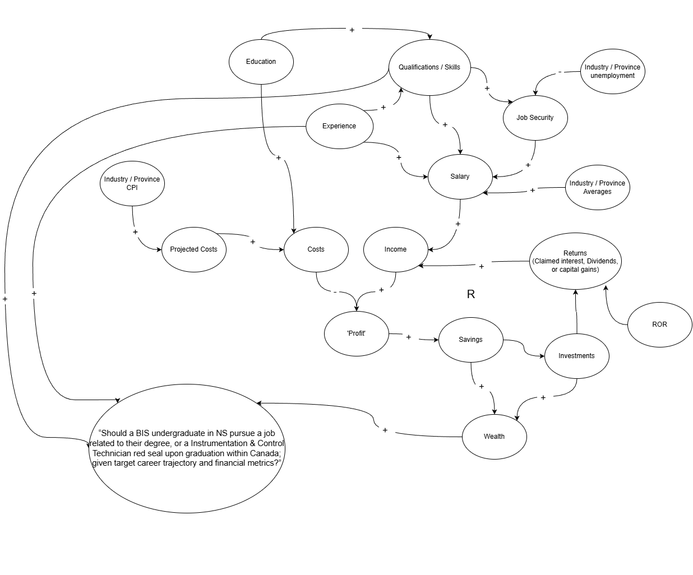

# Career Trajectory NPV Calculator

## Decision Statment
“Should a BIS undergraduate in NS pursue a job related to their degree, or a Instrumentation & Control Technician red seal upon graduation within Canada; given target career trajectory and financial metrics?”

## Executive Summary
This decision pertains to the professional development of this young person; what route they’re going to take into their career. Tradeoffs include income & long term financial position, education, skills developed & experience gained. 

A red seal would provide increased long term job security, and a set of specialized skills and experience, but postpone entry to the workforce.

## Initial Causal Loop Diagram

feedback loop 1: savings -> investment -> interest -> income -> profit -> savings
--> Reinforcing returns on capital (compounding)

