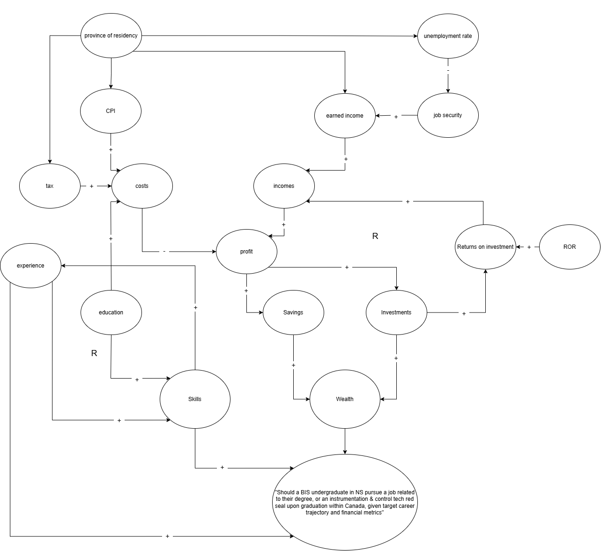
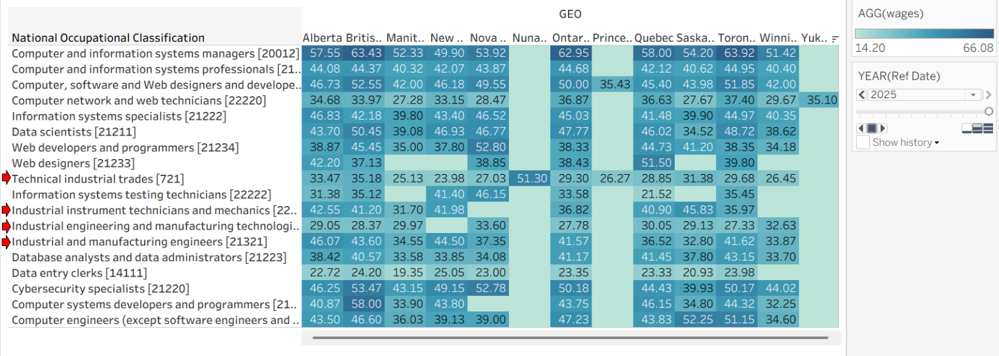
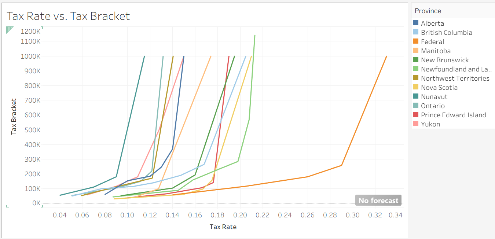

# Career Trajectory NPV Calculator

## Decision Statment
“Should a BIS undergraduate in NS pursue a job related to their degree, or a Instrumentation & Control Technician red seal upon graduation within Canada; given target career trajectory and financial metrics?”

## Executive Summary
This decision pertains to the professional development of this young person; what route they’re going to take into their career. Tradeoffs include income & long term financial position, education, skills developed & experience gained. 

A red seal would provide increased long term job security, and a set of specialized skills and experience, but postpone full time entry to the workforce due to education *requirements. 

## Table of Contents (Links)
* [Background with References](background.md)
* [Data Sources](#5-data-sources-brief-description-with-links)
* [Data readme](data/readme.md)
* [Wrangling](wrangling.md)
* [Dashboard](https://career-trajectory-npv-calculator-3iz73bfhokfbyeu73aua5q.streamlit.app/)
* [Causal Loop Diagram](#causal-loop-diagram)
* [Exploratory Data Analysis](#exploritory-data-analysis-eda)
* [Decision Implications](#implications-for-the-decision)
* [Recommendation](#deliverable-4-recommendation)
* [Limitations & Future Work](#limitations-and-future-work)

## LINK TO DELIVERABLE C : Streamlit dashboard
[Streamlit Dashboard](https://career-trajectory-npv-calculator-3iz73bfhokfbyeu73aua5q.streamlit.app/)
Note: An explanation for usage is included within the dashboard

## Causal Loop Diagram
feedback loop 1: profit -> investment -> returns -> income -> profit
--> Reinforcing returns on capital (compounding)

feedback loop 2: Experience -> Skills -> Experience
--> Reinforcing competence development. Higher skills gain you access to more difficult problems, and the opportunity to work alongside more competent people. Those, in turn, tend to benefit skill development. 

# 2nd Deliverable Additions

## Causal Loop Justification

* The 1st feedback loop requires capital to start. Further, compounding works in both directions. Thus, cost & debt managment is important. Revenue generation is also important. Revenue comes from cabapbilities; skills and experience.  

* The 2nd feedback loop requires we have suffecient of either to get a job in the field of interest, else we lose out of developing both to work an unrelated job. Education is an attempt to kickstart the 2nd loop. 

Figure 5 depicts the relationship between earnings and taxes. Taxes, as a cost, increase variably based income (tax brackets).

Figure 1 depicts the CPI. The CPI is a direct representation of how various cost groups inflate over time. As CPI cost categories increase, so do total costs. 

Figure 4 dipicts how province of residency impacts earned income for different target jobs. We didn't assign -/+ directionality for provincial relationships, as this is a categorical variable. 

The decision maker would like to opimize for fiscal and capability outcomes; these feedback loops are the engines which produce those things.  

## Exploritory Data Analysis (EDA)

Figure 1. Unemployment rate by province

The above visualization depicts the CPI growth of common expenses for individuals. All of these costs are increasing, with provincial hubs experiencing different pressures. 

Contemporarily, Alberta has been facing disproportionate variability (and increases) in natural gas prices. 

Note: This is CPI data, not raw values. This data will be useful for modelling future cost trends using regression as 'm'. We will need to find an alternative data source for 'b'. 

Figure 2. Vacancies for I&C and adjacent jobs

The above visualization depicts job listings for I&C or adjacent positions accross Canada, distinguished by province. There is a positive trend, implying increasing quantities of vacant positions advertised. 

Figure 3. Vacancies for IT and adjacent jobs

This visualization is an imatation of the previous; but filtered based on typical IT jobs - data science, cybersecurity analyst, Networking engineer, and adjacent positions. There is a positive trend, implying increasing quantities of vacant positions advertised.

Figure 4. Wages by province and job

This is all wages advertised in job vacancies in 2025, sorted by province and job category. I've highlighted the I&C trade jobs with red arrows on the left, to distinguish them from the tech jobs. Both IT & I&C routes have $40-50/hr potential for standard roles. Specializations can earn premiums. Management roles have higher potential pay, but content of work shifts from 'engineering' (vertical skill development) to 'managment' (horizontle skill development). 

Figure 5. Tax rate vs. tax bracket by province. 

This visualization depicts tax rates vs. tax brackets by province. The federal tax is larger than provincial taxes. Provincial differences are significant. Nunavut would appear to have the least provincial taxes, while Newfoundland would appear to have the most. 

# Data Statment

Datasets used in this analysis come are sources from below.

APA --> Datasets
Government of Canada, S. C. (2007, June 19). Consumer Price Index by product group, monthly, percentage change, not seasonally adjusted, Canada, provinces, Whitehorse, Yellowknife and Iqaluit. https://www150.statcan.gc.ca/t1/tbl1/en/tv.action?pid=1810000413

Government of Canada, S. C. (2018, June 27). Labour force characteristics by industry, annual. https://www150.statcan.gc.ca/t1/tbl1/en/tv.action?pid=1410002301

Government of Canada, S. C. (2024, March 19). Job vacancies and average offered hourly wage by occupation (unit group), quarterly, unadjusted for seasonality. https://www150.statcan.gc.ca/t1/tbl1/en/tv.action?pid=1410044401

Note: The data for the dashboard was generated by claude using the ERD diagram seen in data/readme.md.

# Deliverable 3
## Implications for the Decision
Our analysis (dashboard) enables the users to compare career options (routes) via select criterion, and view how geography (province) informs their outcomes. 

The criterion categories include: Fiscal & Capability 

Fiscal --> Income, Tax, Costs, Investments ($)

Capability --> Skills in areas of interest (yrs experience)

# Deliverable 4: Recommendation

I recommend doing the I&C. 

A purely fiscal analysis would not favour this. I do not believe the data is fully representative of the context. See a rationale for this below in the limitations section. 

My interest in the subject is a bias; but if I spend my time doing things I'm interested in, I'll explore the topic more, improving capabilities, which directly inform outcomes. The projections in the dashboard say otherwise; but the projections don't consider for the differentiation factor (from combining skills in complimentary domains) and job security. We do model the skill development over time, but that is more difficult to objectively compare than $ vs $.

I believe the I&C Diploma --> Red Seal in I&C --> Cybersecurity path will increase employability in a field of interest, and act a differentiator for future IT jobs in specialized markets, as well as get the D/M a premium for specialized skills & knowledge. 

To implement this, the D/M needs to either find an organization to sponsor their apprenticeship or get education in the field, from which they can pivot into an apprenticeship.

The D/M would benefit from the following: 
* Identifying which topics are required for each level of the red seal, as well as identifying what exemptions exist through the diploma. Emphasize the important things when learning. 
* Planning IT projects which compliment I&C coursework. 
* Curating what organization they would like to work at during co-op's. Target: An organization large enough (or diverse enough in its products / services) that employs both cybersecurity and I&C professionals. This would benefit future lateral movements. 
* Doing part time IT or cybersecurity work while in school. 

## Limitations and Future Work
This analysis is flawed in the following senses: 
* The data is not fully authentic (I used claude to generate some data for this assignment (DASHBOARD), using my ERD as reference), thus it likely deviates from authentic data to a degree.
* The analysis does not consider a persons starting position, which might inform the optimal option
* Yrs of experience (skills) is not the best indicator of competence. However, assigning a 'learning_rate' to different individuals would be difficult in practice. 
* The analysis does not consider unemployment rates, which informs confidence in implementing the career path.
* This model assumes equivalent raises for anyone in the same position; there is more nuance when forecasting income in the real world; relationships w/ decision makers (HR, Managers), perceived competence (based on precedent), and experience on paper - including differentiators like the I&C. 

